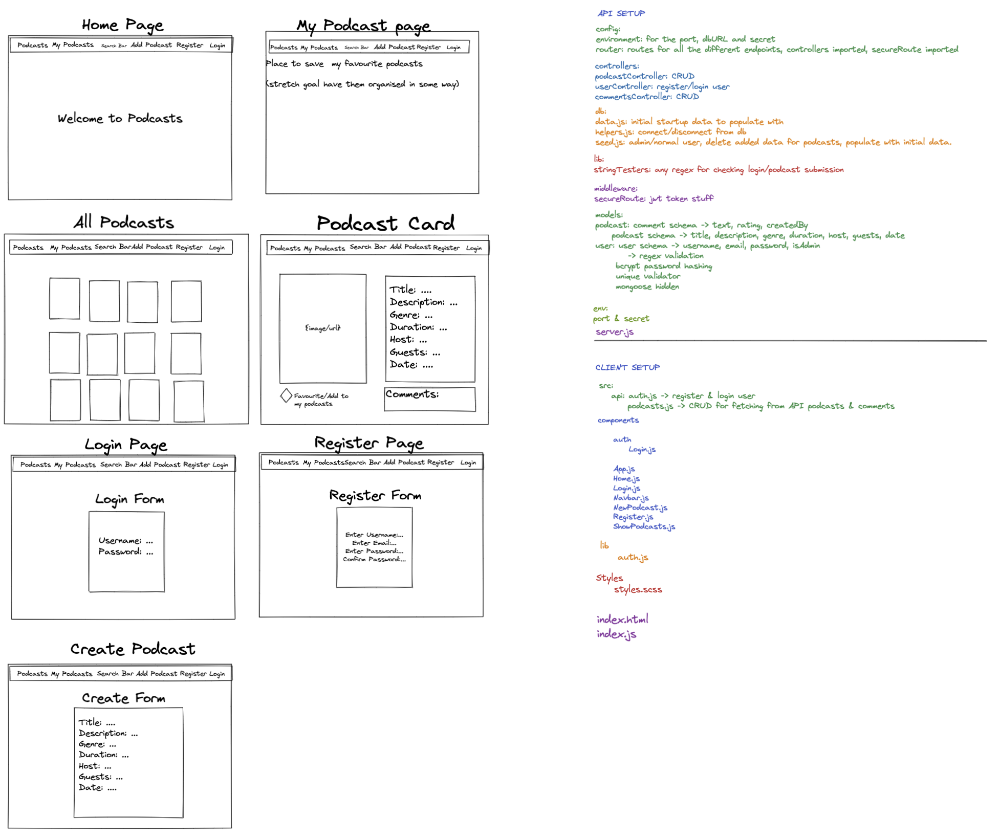

# Project Three

https://podcastsapp.netlify.app/

## Table of Contents:

<li>Project Overview</li>
<li>The Brief</li>
<li>Technologies USed</li>
<li>Approach Taken - (screenshots and featured code)</li>
<li>Wins and Blockers</li>
<li>Bugs</li>
<li>Future Content and Improvements</li>
<li>Key Learnings</li>

## Project Overview

This project consisted of building a custom backend API and frontend website/app using React. This was my first project using MERN (mongoDB, express, react, node). Our team of three had 9 days to build this app. 

## The Brief

<li>Build a full-stack application by making your own back-end and your own front-end
<li>Use an Express API to serve your data from a Mongo database
<li>Consume your API with a separate front-end built with React
<li>Be a complete product which most likely means multiple relationships and CRUD operators for at least a couple of models
<li>Implement thoughtful user stories/wireframes that are significant enough to help you know which features are core MVP and which you can cut
<li>Be deployed online so it's publicly accessible.

## Technologies Used

### Back-end:
<li>Node.js</li>
<li>Mongodb</li>
<li>Express</li>
<li>Bcrypt</li>
<li>Body-parser</li>
<li>Mongoose</li>
<li>jsonwebtoken</li>

### Frontend:
<li>React</li>
<li>Axios</li>
<li>Bulma</li>
<li>SCSS</li>
<li>Http-proxy-middleware</li>
<li>Nodemon</li>
<li>React Router Dom</li>

### Development tools:
<li>VS code</li>
<li>NPM</li>
<li>Insomnia</li>
<li>Git</li>
<li>Github</li>
<li>Google Chrome dev tools</li>
<li>Heroku (deployment)</li>
<li>Trello Board (planning and timeline)</li>
<li>Excalidraw (wireframing)</li>

## Approach Taken

### Day 1

Our team of three quickly settled on the idea of building a podcast website where users could register, login, create and like their own podcasts. Using Trello board and excalidraw we were able to plan out our ideas and divide up the tasks. The Trello board was especially useful when trying to see our progress and what was still missing. Excalidraw was used to visualise our idea better.  

## Day 2 - 3

Our team decided to finish the backend completly first before starting the frontend. The backend side of the project consisted of building CRUD operators for our Mongo database. I was in charge of organised and dividing up the tasks which included creating the podcasts and comments controllers with all the necessary functionalities. A lot of the code was 'boiler plate' code which made it easy to replicate but nonetheless our team had to navigate platforms and tools we had never used before. Some code that I was proud of was because of how complex it was for me at the time to undertand was the SecureRoute.js file.

    import jwt from 'jsonwebtoken';
    import User from '../models/user.js';
    import { secret } from '../config/environment.js';

    const secureRoute = async (req, res, next) => {
      try {
        const authToken = req.headers.authorization;

        if (!authToken || !authToken.startsWith('Bearer')) {
          return res.status(401).send({ message: 'Unauthorized1' });
        }

        const token = authToken.replace('Bearer ', '');

        jwt.verify(token, secret, async (err, data) => {
          if (err) {
            return res.status(401).send({ message: 'Unauthorized2' });
          }

          const user = await User.findById(data.userId);

          if (!user) {
            return res.status(401).send({ message: 'Unauthorized3' });
          }

          req.currentUser = user;
          next();
        });
      } catch (error) {
        return res.status(401).send({ message: 'Unauthorized4' });
      }
    };

    export default secureRoute;

## Day 4 - 9

We started working on the front end fairly swiftly without having had too many git merge conflicts in the previous days. I was in charge of dividing up the tasks fairly and to each members' strengths. I created the MyPodcasts.js, Navbar.js, NewPodcast.js, SearchByName.js and the EditPodcast.js. During this time we tried to git merge as often as possible to make sure we had as few bugs and conflicts with our app (since the page would completely shut down for one slightly off element). In the final couple of days we had to play catch up with Bulma and styling since we weren't all quite comfortable with Bulma. Communication was a key part of this project as well as offering support to our teammates. Once finished with our project I deployed it using Netlify. One piece of code that I was particularily pleased about was the authentication file where I learnt and developed my understanding of Axios. 

    import axios from 'axios';

    export const registerUser = async (user) => {
      const options = {
        method: 'POST',
        url: '/api/register',
        data: user,
      };
      const { data } = await axios.request(options);
      return data;
    };

    export const getUser = async (userId) => {
      const options = {
        method: 'GET',
        url: `/api/user/${userId}`,
        headers: {
          authorization: `Bearer ${window.sessionStorage.getItem('token')}`
        }
      };

      const { data } = await axios.request(options);
      return data;
    };

    export const loginUser = async (credentials) => {
      const options = {
        method: 'POST',
        url: '/api/login',
        data: credentials,
      };

      const { data } = await axios.request(options);
      if (data.token) {
        window.sessionStorage.setItem('token', data.token);
      } else {
        window.sessionStorage.removeItem('token');
      }
      return data.message;
    };

## Wins and Blockers

A big win for me and the team was the development, of us as individuals, of our communication skills as coders. Our planning also played a major part as to why we managed to achieve our goals and even push for some stretch goals. 

One blocker that I noticed was our lack of skills in styling with Bulma and trying to reconcile our views as a team of what the styling theme should look like. Another blocker was the struggle I had with creating a like button for the podcasts which required some professional guidance.

## Bugs 

Perhaps not necessarily a bug but more of a hinderance is the lack of pop up when entering your password or email wrong when logging in as well as for when registering. Another 'bug' but maybe not entirely problematic is that the page is slow to load when displaying all the podcasts.

 ## Future Content and Improvements

A major improvement can be implementing more notifications when registering with a weak password or with a username that already exists. I could also optimize our styling better as well to make the flow of the navigation smoother. 

 ## Key Learnings

 Communication and planning were the number one aspects I learnt from this project. Without these two things, a team of three with different views and opinions can very quickly become a chaotic playground with no foundation. I learnt a lot about how the backend API works with MongoDB and how to create secure routes inside the CRUD operators.